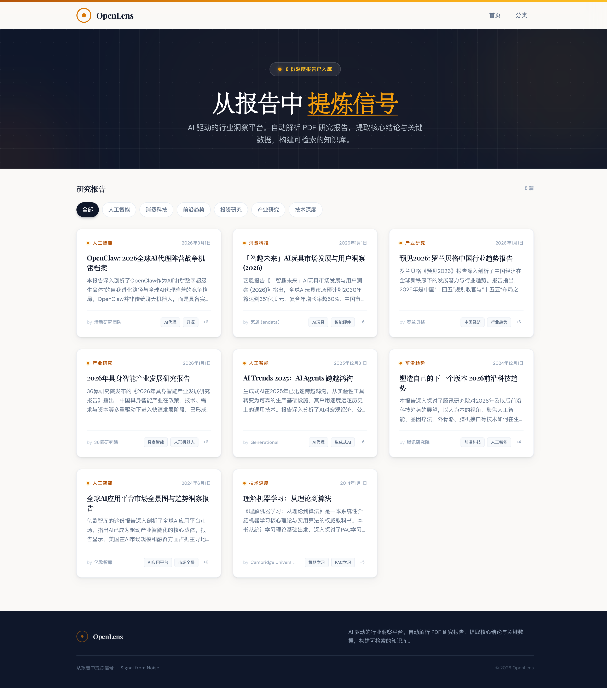
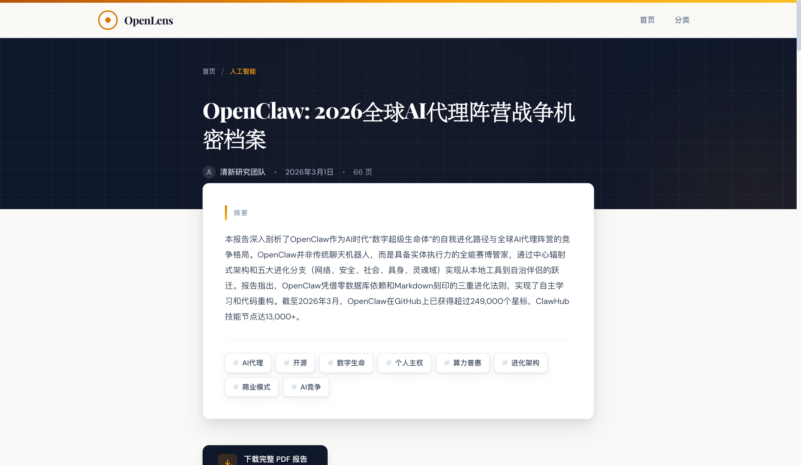

<div align="center">

# OpenLens

**Signal from Noise.**

PDF 扔进来，知识库长出来。

[](https://jyao0708.github.io/openlens/)
[](https://astro.build)
[](https://tailwindcss.com)
[](https://github.com/jyao0708/openlens/actions)

<br />



</div>

---

## The Problem

你有 50 份行业研究报告。每份 60~100 页。你没有时间全读完，但你需要里面的核心结论和关键数据。

## The Solution

OpenLens 是一个 **AI 驱动的研究报告知识库**。把 PDF 扔进 `inbox/` 目录，运行一条命令，AI 自动完成：

- **解析** — 提取标题、来源、分类、标签
- **提炼** — 生成摘要、核心结论、关键数据表
- **构建** — 输出结构化 Markdown，自动生成静态站点
- **发布** — 一键部署到 GitHub Pages，零成本托管

**一条命令，从 PDF 到可检索的知识库。**

---

## Architecture

```
inbox/pdf/              scripts/                   src/content/reports/
  *.pdf          -->    process-pdfs.ts     -->      *.md (frontmatter + body)
                        |                           |
                        | AI Analysis               | Astro Build
                        | (Gemini 2.5)              | (Static Site)
                        |                           |
                        v                           v
                   3-Layer Validation          GitHub Pages
                   L1 Cleanup                  https://jyao0708.github.io/openlens/
                   L2 Normalize
                   L3 Zod Schema
```

### Processing Pipeline

| Stage | What Happens |
|-------|-------------|
| **Scan** | 扫描 `inbox/pdf/`，跳过已处理文件（幂等） |
| **Split** | 超过 30MB 的 PDF 按 50 页分块 |
| **Analyze** | 每个分块发送到 AI 模型提取结构化信息 |
| **Merge** | 多分块结果合并为完整报告 |
| **Validate** | 3 层校验：字符串清洗 → 确定性标准化 → Zod Schema |
| **Fallback** | 主模型失败自动降级到备用模型 |
| **Output** | 生成 Markdown + 复制 PDF 到 `public/pdf/` |

---

## Quick Start

```bash
# Clone
git clone https://github.com/jyao0708/openlens.git
cd openlens
npm install

# 开发模式
npm run dev

# 处理 PDF（需要 AI API）
cp your-report.pdf inbox/pdf/
npm run process

# 构建 & 预览
npm run build
npm run preview
```

### Environment Variables

| Variable | Default | Description |
|----------|---------|-------------|
| `OPENLENS_API_URL` | `http://localhost:8000/v1/chat/completions` | OpenAI-compatible API endpoint |
| `OPENLENS_API_KEY` | — | API key |
| `OPENLENS_CONCURRENCY` | `3` | 并行处理数 |

支持任何 OpenAI-compatible API（OpenAI、Claude、Gemini、本地 Ollama 等）。

---

## Tech Stack

| Layer | Technology |
|-------|-----------|
| **Framework** | [Astro 6](https://astro.build) — 零 JS 静态输出 |
| **Styling** | [Tailwind CSS 4](https://tailwindcss.com) — 原子化 CSS |
| **AI** | OpenAI-compatible API — 模型可切换 |
| **PDF** | [pdf-lib](https://pdf-lib.js.org/) — 纯 JS PDF 分块 |
| **Validation** | [Zod](https://zod.dev/) — 3 层 Schema 校验 |
| **Deploy** | GitHub Actions + GitHub Pages |
| **Language** | TypeScript throughout |

---

## Content Schema

每篇报告自动生成以下结构：

```yaml
title: "AI Trends 2025: AI Agents 跨越鸿沟"
slug: ai-trends-2025-ai-agents-cross-chasm
source: Generational
date: 2025-12-31
category: 人工智能          # 6 个受控分类
tags: [AI代理, 生成式AI]    # 1-8 个标签
summary: "..."              # 10-300 字摘要
keyFindings: [...]          # 1-6 条核心结论
keyData:                    # 结构化数据点
  - metric: "市场规模"
    value: "$1.2T"
    note: "2025 年预测"
pdf: /pdf/report-name.pdf
```

**6 个分类：** 人工智能 · 消费科技 · 前沿趋势 · 投资研究 · 产业研究 · 技术深度

---

## Project Structure

```
openlens/
├── inbox/pdf/              # Drop zone: 放入待处理的 PDF
├── scripts/
│   ├── process-pdfs.ts     # 主入口
│   ├── config.ts           # 全局配置
│   └── lib/
│       ├── ai-client.ts    # AI API 客户端（重试 + 模型降级）
│       ├── pdf-analyzer.ts # 分析引擎（整体 + 分块 + 校验）
│       ├── pdf-splitter.ts # PDF 分块器
│       ├── prompt.ts       # Prompt 模板
│       └── schema-validator.ts  # 3 层校验器
├── src/
│   ├── content/reports/    # 生成的 Markdown（Astro Content Collection）
│   ├── components/         # Astro 组件
│   ├── layouts/            # 页面布局
│   ├── pages/              # 路由页面
│   └── styles/global.css   # 设计系统（CSS Cascade Layers）
├── public/pdf/             # PDF 下载文件
└── .github/workflows/      # CI/CD
```

---

## Screenshots

<div align="center">
<table>
<tr>
<td align="center"><b>Homepage</b></td>
<td align="center"><b>Report Detail</b></td>
</tr>
<tr>
<td></td>
<td></td>
</tr>
</table>
</div>

---

## Roadmap

- [ ] Full-text search (Pagefind / Fuse.js)
- [ ] DOCX / XLSX / Markdown source support
- [ ] Multi-language report analysis
- [ ] RSS feed generation
- [ ] Report comparison & trend analysis
- [ ] API endpoint for programmatic access

---

## License

MIT

---

<div align="center">

**从报告中提炼信号 — Signal from Noise**

[Live Demo](https://jyao0708.github.io/openlens/) · [Report Bug](https://github.com/jyao0708/openlens/issues) · [Request Feature](https://github.com/jyao0708/openlens/issues)

</div>
